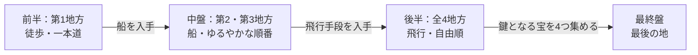

# RPG体験仕様 v2 — 世界マップ攻略型

2026年9月25日作成・依頼者承認済み

## 決定事項と前提

このゲームは「世界マップを攻略していくこと＝ゲームを進めること」という、一般的な2D RPGの形に作り替える。依頼者は、この方針に合わせて既存の全仕様を置き換えることを承認した（2026年9月25日）。

| 項目 | 決定内容 |
| --- | --- |
| ゲームの形 | 世界マップが最初から土台として存在し、その上の城・町・村・洞窟・塔・ダンジョンを攻略して進む |
| 行動範囲の制限 | メニューではなく世界そのもの（地形・乗り物・鍵・強い魔物）で制限する |
| 物語の順番 | 前半は一本道、飛行手段の入手後は自由順 |
| 転移呪文 | 一度訪れた町・城へ戻れる。名称は独自のものにする |
| 旧「本編」 | 世界マップ型の本体へ移し、物語・敵・ボス・イベントを各拠点へ配置し直す |
| 仕様変更の権限 | 既存の企画書・scope-lock契約・凍結verifyを、この仕様に合わせて書き換えてよい |

変えないもの：Godot 4.7.2-stable、GDScript、内部解像度512×288、32pxタイル、3〜4人パーティ、職業・アビリティ装着・魔物化の仕組み、1周約60時間という最終目標。

参考にするのはドラゴンクエスト7とファイナルファンタジー5の「遊びの形」だけとする。地名・呪文名・マップ配置・画像・音・コードは使わない。

## 体験の核

プレイヤーが感じるべきことは「自分の足で世界を広げている」という手応えである。実装の良し悪しは、検査の合格数ではなく次の5点で判断する。

1. **町を出ると世界が広がる。** 町の出口を抜けた瞬間に世界マップへ切り替わる。メニューで「世界地図へ」を選ぶ操作はない。
2. **見えているのに行けない場所がある。** 海の向こうの島、山に囲まれた土地、閉ざされた門が見える。「いつかあそこへ」と思わせる。
3. **行けるようになった理由が分かる。** 船を得た、鍵を得た、ボスを倒した、など。解放の理由は必ずゲーム内の出来事である。
4. **戻ることが楽である。** 転移呪文で訪れた町へすぐ戻れる。育てた職業を試しに、前の場所を再訪できる。
5. **後半は自分で順番を選べる。** 飛行手段を得たあと、どの塔から攻めるかをプレイヤーが決める。

この5点のうち、機械で確かめられる部分（メニュー項目の有無、出口での世界マップへの切り替え、解放の条件など）は受入条件にする。手触りの評価は `PLAYTEST_QUEUE.md` に分ける。拠点選択メニューで移動する、理由なく道が開くといった実装は、この仕様に反するものとして扱う。

## 世界構造

世界は既存の256×256マップと4地方を土台にし、進行は「徒歩→船→飛行」の3段階で広がる。地方の名前は未定のため、ここでは第1〜第4地方と呼ぶ。

| 段階 | 移動手段 | 行ける範囲 | 順番の自由度 | 目安時間 |
| --- | --- | --- | --- | --- |
| 前半 | 徒歩 | 第1地方 | 一本道 | 約10時間 |
| 中盤 | 徒歩＋船 | 第1〜第3地方の沿岸と島 | 大まかな順番あり | 約20時間 |
| 後半 | 徒歩＋船＋飛行 | 全4地方 | 自由順 | 約25時間 |
| 最終盤 | すべて | 最後の地 | 一本道 | 約5時間 |

目安時間は60時間目標を割り振った設計上の予算であり、実測値ではない。

壁の種類は次の5つに限定する。種類を増やしすぎると、なぜ行けないのかが分かりにくくなるためである。

- **地形**：海・深い森・高い山。乗り物で越える。
- **門・扉**：鍵や通行証で開く。
- **関所・橋**：ボス撃破や事件の解決で通れるようになる。
- **強い魔物**：通れるが危険。目安は町の噂で伝える。
- **封印**：最終盤の地。後半に集める宝で解く。

## 進行表

進行は14の節目で組み、各節目で「どこへ行き、何を得て、何が開くか」を1行で定義する。拠点の具体名と配置は、既存の49拠点（町村11・ダンジョン16・小拠点22）から割り当てる。

| 節目 | 段階 | 主な舞台 | 得るもの | 開くもの |
| --- | --- | --- | --- | --- |
| 1 | 前半 | 始まりの村 | 仲間2人・最初の職業 | 村の外の草原 |
| 2 | 前半 | 近くの洞窟 | 通行証 | 川向こうの関所 |
| 3 | 前半 | 第1地方の城下町と城 | 転職の解放 | 城の北の森 |
| 4 | 前半 | 森の塔 | 4人目の仲間 | 山道 |
| 5 | 前半 | 港町 | 転移呪文・船 | 海 |
| 6 | 中盤 | 第2地方の島々 | モンスター職の解放 | 第2地方の奥地 |
| 7 | 中盤 | 第2地方のダンジョン | 鍵 | 各地の鍵付きの扉 |
| 8 | 中盤 | 第3地方の沿岸 | 上級職の解放 | 第3地方の内陸 |
| 9 | 中盤 | 第3地方の城 | 飛行手段 | 空（全地方） |
| 10〜13 | 後半 | 4つの塔・ダンジョン（順不同） | 封印を解く宝を1つずつ | 各地の隠し拠点 |
| 14 | 最終盤 | 最後の地 | エンディング | — |

節目10〜13の4か所は、どの順番で攻略しても物語が成り立つように作る（詳細は「難易度と自由順の設計」）。

寄り道は節目の間に置く。小拠点22か所を、宝・休息・噂・職業の試し場として配置し、本筋の進行には必須としない。

## 最初の地方の詳細

最初の開発対象は、ニューゲームから最初のボス（節目2の洞窟の奥）までの約1時間である。この範囲が「イメージどおり」になるまで、次の地方には進まない。

1. **ニューゲーム**：主人公は始まりの村の家の中で目を覚ます。画面は村の内部マップで、歩いて外へ出られる。
2. **村の中**：村人と話せる。宿・道具屋・武器屋がある。仲間2人と出会い、3人パーティになる。
3. **村を出る**：村の出口を抜けると、世界マップ上の村の入口セルの一つ手前に、外向きの向きで立った状態で世界マップへ切り替わる。
4. **最初の草原**：魔物とのランダムエンカウントがある。東に洞窟の入口が見え、北には川と閉ざされた関所が見える。
5. **洞窟**：入口セルで決定キーを押すか、入口へ歩いて入ると洞窟内部へ切り替わる。地下2階構成で、階段で上下する。宝箱が3つある。
6. **最初のボス**：地下2階の奥。倒すと関所の通行証を得る。
7. **帰り道**：洞窟を出ると入口セルの一つ手前に外向きで戻る。関所へ行くと、門番が通行証を確認して通してくれる。

合格条件（依頼者が画面を見て判断する）：

- [ ] 村の中を歩いて外へ出ると、そのまま世界マップになる
- [ ] 世界マップから洞窟に入り、ボスを倒し、外へ戻れる
- [ ] 関所が通行証の入手前は閉まり、入手後は開く
- [ ] 途中でセーブし、再開すると同じ場所・同じ向きから続く
- [ ] どの画面にも「世界地図へ」「本編へ」のメニュー項目がない

通しプレイを避けたい依頼者の方針に配慮し、確認はこの範囲だけの短い試遊か、Codexが撮った画面の連続スクリーンショットで行う。

## 移動・乗り物・転移呪文

移動は既存の `WorldMovement`（1セル150ms）をそのまま使い、入手時期と通れる地形だけを新しい進行に合わせる。

| 手段 | 入手時期 | 通れる地形 | 乗り降り | 魔物との遭遇 |
| --- | --- | --- | --- | --- |
| 徒歩 | 最初から | 草地・森・道・橋・入口 | — | あり |
| 船 | 節目5（港町） | 海・水路 | 港か浅瀬で乗り降り | 海の魔物あり |
| 飛行 | 節目9（第3地方の城） | 山を含む全地形の上空 | 草地・道で着陸 | なし |

**拠点への出入り**：入口セルに歩いて入ると内部へ切り替わる。出口に歩いて出ると、入口セルの一つ手前に、外向きの向きで戻る。出入りした直後にすぐ逆方向へ戻ってしまわないよう、1歩動くまで同じ入口は反応しない。船・飛行のまま拠点へは入れず、降りてから入る。

**転移呪文**：

- 節目5で覚える。仮の名前は「帰還の風」とし、最終名は依頼者が決める。
- 一度入ったことのある町・村・城が行き先一覧に並ぶ。洞窟・塔・ダンジョンは対象外。
- 使うとMPを消費し、選んだ拠点の入口セルの前に立つ。乗り物は、船なら最寄りの港、飛行なら着地点へ一緒に移る。
- ダンジョンの中からは使えない。ダンジョンから外へ脱出する道具・呪文は別に用意する（仮名「脱出の糸」）。

**保存**：保存データには、いる場所（世界マップか、どの拠点のどの部屋か）、セル、向き、乗り物、転移の行き先一覧を記録する。

## 拠点の中身

すべての拠点は、主人公が歩き回れる内部マップとして作る。メニューやボタンで「観察」「相談」を選ぶ形式は使わない。

| 種類 | 広さの目安 | 必ず置くもの | 置いてよいもの |
| --- | --- | --- | --- |
| 村 | 1画面程度 | 住人3〜6人・宿・道具屋 | 井戸・畑・小さな宝箱 |
| 町 | 2〜4画面 | 住人8人以上・宿・道具屋・武器屋・防具屋・祠 | 酒場・噂話・隠し通路 |
| 城 | 城下町＋城内の2層 | 王や領主・兵士・宝物庫 | 地下牢・図書室・イベント用の部屋 |
| 洞窟 | 2〜3階 | 階段・宝箱・ボスの部屋 | 行き止まり・隠し宝箱・技で開く近道 |
| 塔 | 3〜6階 | 階段・宝箱・最上階のボス | 仕掛け扉・外周の足場 |
| ダンジョン | 3〜5階 | 階段・宝箱・ボス・脱出地点 | 仕掛け・回復の泉 |

- 住人とは向き合って決定キーで話す。台詞は進行段階によって変わる。
- 祠は既存の魔物化解除の場として使う。
- 既存5ダンジョンの「技で開く近道」と「補給箱」の仕組みは、新しいダンジョンでも使う。
- 内部のタイルは、既存の素材台帳の画像を使う。足りない画像は、作る前に一覧にして依頼者へ確認する。

## 戦闘・職業・アビリティ・魔物化

戦闘と育成の仕組みは既存の実装をそのまま使い、変えるのは「いつ解放されるか」と「どこで戦うか」だけである。

| 仕組み | 扱い | 新しい解放時期 |
| --- | --- | --- |
| 戦闘（ターン制・敵の行動予定表示） | そのまま使う | 最初から |
| 人間職12種 | そのまま使う | 基本職は節目3、上級職は節目8 |
| モンスター職8種と侵蝕・魔物化 | そのまま使う | 節目6 |
| アビリティ装着（枠数制限） | そのまま使う | 節目3 |
| 戦闘前の自動保存と全滅からの復帰 | そのまま使う | 最初から |
| 「周辺で戦う」による育成 | 廃止する | — |
| 固定の連戦（1地点3戦） | ボス前の区画など一部だけに残す | — |

**魔物との出会い方**：世界マップとダンジョンでは、歩いているとランダムに戦闘が始まる。「周辺で戦う」を選ぶ方式はやめ、育成は世界マップを歩き回って行う。遭遇の頻度は地域ごとに決める。町・村・城の中では戦闘は起きない。

敵30種の配置は、進行表の地域と強さの段階に合わせて割り振り直す。

## 難易度と自由順の設計

敵の強さは場所ごとに固定し、プレイヤーの強さに合わせて変えない。自由順の後半では、4か所の難しさに差をつけ、「どこから攻めるか」自体を選択にする。

| 後半の拠点 | 難しさ | 町の噂で伝える目安 |
| --- | --- | --- |
| 塔A | 易しい | 「東の塔は、今のあんたたちなら何とかなる」 |
| 塔B | やや易しい | 「砂の塔は暑さで体力を奪われるそうだ」 |
| ダンジョンC | やや難しい | 「北の洞窟から戻った者は少ない」 |
| ダンジョンD | 難しい | 「海底の神殿には、まだ誰も辿り着いていない」 |

台詞は例であり、最終的な文面ではない。

自由順で物語を破綻させないための決まり：

- 後半4か所の話は、それぞれ単独で始まって終わる。他の3か所の結果を前提にしない。
- 攻略した数（0〜4）に応じて、拠点の人の台詞が少し変わる。攻略の順番そのものには依存させない。
- 4か所の報酬は、どの順番で手に入れても強すぎず弱すぎない範囲にする。
- 最終盤は4つの宝がそろった時だけ開き、そこから先は一本道にする。

## 物語の構成と旧本編の再配置

旧本編（6章・長編80話・480戦）は削除せず「素材」として凍結し、使える話・敵・ボス・台詞を世界マップ上の拠点へ移す。移すのは中身だけで、章を選んで進む仕組みは移さない。

| 旧本編の要素 | 移し先 | 扱い |
| --- | --- | --- |
| 第1章〜第6章の本筋 | 節目1〜14の主要イベント | 本筋として作り直す |
| 長編80話のうち1話完結に近い話 | 小拠点・寄り道・後半4か所 | 拠点ごとの話として配置 |
| 80件の意思決定 | 住人との会話の選択肢 | 必要なものだけ残す |
| 手帳（手掛かりの記録） | そのまま残す | 世界マップでも読める |
| 既存5ダンジョン | 第1〜第2地方のダンジョン | 内部マップを歩ける形に揃える |
| 1地点3戦の連戦 | ボス前の区画 | 一部だけ残す |

移し替えの順番：

1. 最初の地方（節目1〜5）の本筋を作る。旧第1章の内容を優先して使う。
2. 旧本編の80話を一覧にし、「本筋」「寄り道」「使わない」に仕分ける。仕分けは依頼者が確認する。
3. 地方ごとに、仕分けた話を拠点へ配置する。

旧本編の保存データは、新しい構造へ引き継がない。新しい構造ではニューゲームから始める。

## 既存仕様・契約の変更方針

2026年9月25日に `AGENTS.md` と `.scope-lock/spec.lock.json` を読んだ結果、変更が必要な要件はR-07の1件だけで、残りは非交渉事項と作業規則の改訂で足りる。

**受入要件（R-01〜R-08）の扱い**

| 要件 | 内容 | 扱い |
| --- | --- | --- |
| R-01 職業データ定義 | 職業20種のデータ | そのまま維持 |
| R-02 職業変更と熟練度 | JPと行動回数、旧保存のマスター維持 | そのまま維持 |
| R-03 アビリティ装着枠 | FF5方式の枠 | そのまま維持 |
| R-04 魔物化 | 遷移と解除 | そのまま維持 |
| R-05 戦闘ループ | ターン制戦闘の一巡 | そのまま維持 |
| R-06 セーブ／ロード往復 | 状態の完全一致 | そのまま維持。保存項目に世界マップ上の位置・向き・転移先を含める |
| R-07 第1章の通し到達 | `smoke_chapter1.gd` で旧第1章をクリア | **差し替え**。新R-07「最初の地方の通し到達」（村の内部で開始→出口から世界マップ→洞窟→ボス→関所通過）に置き換える |
| R-08 全体テスト緑 | 全テスト成功 | そのまま維持 |

**非交渉事項・作業規則との衝突と対処**

| 現行の規則 | 衝突の内容 | 対処 |
| --- | --- | --- |
| 「v1要件を満たす前のリファクタは禁止」（spec.lock） | 本編の構造切り替えは大きな作り直しに当たる | 依頼者承認の改訂として、本仕様の構造切り替えを明示的に許可する |
| 「新しいphase・マイルストーンを独自に設けない」（spec.lock） | 本仕様の段階的な作業順 | 作業順は依頼者が決めたもので、Codexが独自に設けたものではないと明記する |
| 「主観判断は受入条件に含めない」（AGENTS.md） | 本仕様の「体験の核」 | 機械で確かめられる部分（メニュー項目がない、出口で世界マップに切り替わる等）を受入条件にし、手触りの評価は `PLAYTEST_QUEUE.md` へ分ける |
| 「spec.lock.jsonと保護パスは編集禁止、書き込みはツールで遮断」（AGENTS.md） | Codexは契約を書き換えられない | spec.lock.jsonの改訂は依頼者がGitHubの画面で行う。Codexは改訂案を書くだけにする |
| R-02の「旧保存の取得済みマスターは維持」 | 旧保存を引き継がない方針 | 職業・熟練度の読込は維持し、引き継がないのは位置と物語の進行だけとする |

固定事項（Godot 4.7.2、GDScript、512×288、32px、ジャンル「ドラクエ7・FF5系」、約60時間）は本仕様と矛盾しないため変更しない。

**作業の順番**（1回のプロンプトで1つ。受入テストを実装より先に固める）

1. **契約の改訂（依頼者）**：Claudeが用意した改訂版 `spec.lock.json`（目的と非交渉事項の改訂、改訂履歴の追加）を、GitHubの画面で貼り替える。R-07はまだ差し替えない。
2. **文書の改訂（Codex）**：本仕様を `docs/experience-spec-v2.md` として追加し、`AGENTS.md` に改訂を追記し、旧文書に位置付けの注記を入れる。コードとテストは触らない。
3. **受入テストの作成（Codex）**：新R-07用の自動プレイ検査を書く。実装がないので失敗して正しい。
4. **受入テストの確認と固定（依頼者＋Claude）**：Claudeが検査の中身を確認し、依頼者がR-07を差し替えて保護パスに加える。CIのR-07実行行も合わせて直す。
5. **最初の地方の実装（Codex）**：村の内部で開始、出口から世界マップ、洞窟、ボス、関所。「世界地図へ」「本編へ」を廃止する。新R-07を含む全verifyを緑にする。
6. **画面の確認（依頼者）**：スクリーンショットか短い試遊で確認する。次の地方の作業指示は、この確認の後に出す。

テストを実装より先に固める理由は、Codexが自分で書いたテストを自分で合格させる形を避けるためである。

画面と演出の仕様

2026年9月26日に、最初の地方の画面を依頼者が確認した結果を受けて追加した。画面の作り方・操作・演出は、ドラゴンクエスト7とファイナルファンタジー5（ピクセルリマスター版を含む）など、一般的な2D RPGの定石に積極的に従う。使わないのは、市販ゲームの画像・音・コード・固有名詞・マップ配置だけである。

画面構成と操作
探索中は画面全体をマップにする。常に出ているボタン列、タイトル表示、侵蝕の数値は出さない。
決定キーで「話す・調べる」、メニューキーでコマンド窓（どうぐ・そうび・じょうたい・へんせい・セーブなど）を開く。
会話は画面下部の会話窓に出し、話している人の名前を窓の上に出す。文は決定キーで1つずつ送る。
窓は、濃い紺色の半透明の地に白い細い枠と丸い角。文字は大きく、読みやすくする。
場所に入ったとき、場所の名前を画面上部に数秒だけ出して消す。
世界全体の地図は、道具「世界地図」を使ったときだけ全画面で開く。現在地を点滅で示し、閉じると元の画面に戻る。
明るさと色
全体を明るく、色を鮮やかにする。暗くするのは、洞窟や夜など場面に理由があるときだけ。
屋外は日中の明るい色にする。草は鮮やかな緑、道は明るい土色、水は明るい青。
町・村・城
建物の外観（屋根・壁・扉・窓）を置き、扉から入ると建物の中に切り替わる。
建物の中は床・壁・家具（机・椅子・棚・寝台・たる・つぼ）で作る。店はカウンター越しに店員が立ち、宿屋には受付と寝台がある。
村には住人を4〜6人以上置き、一部は決まった範囲を歩き回る。話しかけると、こちらを向く。
村の外周は、柵・木・水辺などで自然に囲む。
世界マップ
草原・森・山・川・橋・道・海岸を描き分ける。
拠点は小さな絵で示し、村・町・城・洞窟・塔で絵を変える。
通れない所は、石垣ではなく山・海・深い森などの自然な地形で示す。
関所は門の絵で示し、閉じているときと開いているときで絵を変える。
関所の先には道を続ける。まだ作っていない地方の手前は、自然な地形で行き止まりにする。
ダンジョン
洞窟は岩肌の壁と地面を描き分け、たいまつなどの明かりで暗くしすぎない。
宝箱は赤や金などの目立つ色にし、開けると開いた絵に変わる。
階段は、上りか下りかが絵で分かるようにする。
戦闘
敵が左、味方が右の今の並びを保つ。
背景は場所ごとに用意する：平原・森・洞窟・塔・砂漠・海・空・城の8種。
コマンドと能力値は、会話窓と同じ見た目の窓に出す。
敵が現れたとき、勝ったときに、短い演出（画面の点滅や揺れなど）を入れる。
### 絵柄の統一と、人物・敵の絵

- 地形・建物・家具・宝箱・門・拠点アイコン・人物・敵・戦闘背景を、明るく描き込まれた一つの絵柄にそろえる。単純な記号のような絵を混ぜない。
- 最初に仲間4人（カイナ・リオネ・ハルド・スイナ）の設定画（全身の正面と横向き、顔）を作って固定し、以降の人物の絵はすべてこれに合わせる。
- 仲間は、人間の職業12種それぞれに衣装を持つ。職業を変えると、歩行と戦闘の絵がその職業の衣装に変わる。髪・顔・体格は職業が変わっても同じにして、誰なのかが一目で分かるようにする。
- 同じ職業の衣装は、4人で共通の色・形・持ち物を持たせ、職業が見て分かるようにする。
- 魔物化した姿（8系統×4人）、侵蝕の兆候の絵、敵22種も、新しい絵柄で描き直す。

音
曲：村・世界マップ・洞窟・戦闘・ボス戦・勝利。
効果音：決定・取り消し・宝箱・扉・階段・攻撃・被ダメージ・回復。
名前（最初の地方）
ID	名前
最初の地方（riverlands）	エルヴァ地方
start_village	ミルフェ村
主人公の家	カイナの家
first_cave	ソルダ洞窟
first_gate	ベルナの関所
first_boss	水門の荒獣
gate_pass	関所の通行証
外部素材の条件
使ってよいライセンス：CC0、MIT、BSD、Apache-2.0、Unlicense。
使わないもの：GPL・AGPL・CC-BY-SA・非商用限定・ライセンス不明・独自条件のもの。市販ゲームから抜き出した画像や音は、どのようなライセンス表示があっても使わない。
取り込んだ素材ごとに、入手先のURL・作者・ライセンス・取得日を素材台帳に記録し、ライセンス文を THIRD_PARTY_NOTICES.md にまとめる。
取り込んだ素材は、docs/asset-spec.md の大きさ・色数・透過の規約に合わせて変換してから使う。 

## 未決事項

次の項目は、依頼者の判断が必要なため仮置きにしている。

- [ ] 4地方と主要拠点の名前
- [ ] 転移呪文・脱出道具の正式名（仮名「帰還の風」「脱出の糸」）
- [ ] 物語の大筋：主人公の目的と、後半4つの宝が何か
- [ ] 目安時間の配分（前半10・中盤20・後半25・最終盤5時間）でよいか
- [ ] 「周辺で戦う」の廃止と、ランダムエンカウントへの切り替えでよいか
- [ ] 旧保存は職業・熟練度だけ読み込み、位置と進行は引き継がないことでよいか
- [ ] 最初の地方の確認方法：短い試遊か、スクリーンショットか
