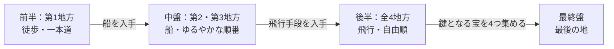

# RPG体験仕様 v2 — 世界マップ攻略型

2026年9月25日作成・依頼者承認済み

## 決定事項と前提

このゲームは「世界マップを攻略していくこと＝ゲームを進めること」という、一般的な2D RPGの形に作り替える。依頼者は、この方針に合わせて既存の全仕様を置き換えることを承認した（2026年9月25日）。

| 項目 | 決定内容 |
| --- | --- |
| ゲームの形 | 世界マップが最初から土台として存在し、その上の城・町・村・洞窟・塔・ダンジョンを攻略して進む |
| 行動範囲の制限 | メニューではなく世界そのもの（地形・乗り物・鍵・強い魔物）で制限する |
| 物語の順番 | 前半は一本道、飛行手段の入手後は自由順 |
| 転移呪文 | 一度訪れた町・城へ戻れる。名称は独自のものにする |
| 旧「本編」 | 世界マップ型の本体へ移し、物語・敵・ボス・イベントを各拠点へ配置し直す |
| 仕様変更の権限 | 既存の企画書・scope-lock契約・凍結verifyを、この仕様に合わせて書き換えてよい |

変えないもの：Godot 4.7.2-stable、GDScript、内部解像度512×288、32pxタイル、3〜4人パーティ、職業・アビリティ装着・魔物化の仕組み、1周約60時間という最終目標。

参考にするのはドラゴンクエスト7とファイナルファンタジー5の「遊びの形」だけとする。地名・呪文名・マップ配置・画像・音・コードは使わない。

## 体験の核

プレイヤーが感じるべきことは「自分の足で世界を広げている」という手応えである。実装の良し悪しは、検査の合格数ではなく次の5点で判断する。

1. **町を出ると世界が広がる。** 町の出口を抜けた瞬間に世界マップへ切り替わる。メニューで「世界地図へ」を選ぶ操作はない。
2. **見えているのに行けない場所がある。** 海の向こうの島、山に囲まれた土地、閉ざされた門が見える。「いつかあそこへ」と思わせる。
3. **行けるようになった理由が分かる。** 船を得た、鍵を得た、ボスを倒した、など。解放の理由は必ずゲーム内の出来事である。
4. **戻ることが楽である。** 転移呪文で訪れた町へすぐ戻れる。育てた職業を試しに、前の場所を再訪できる。
5. **後半は自分で順番を選べる。** 飛行手段を得たあと、どの塔から攻めるかをプレイヤーが決める。

この5点のうち、機械で確かめられる部分（メニュー項目の有無、出口での世界マップへの切り替え、解放の条件など）は受入条件にする。手触りの評価は `PLAYTEST_QUEUE.md` に分ける。拠点選択メニューで移動する、理由なく道が開くといった実装は、この仕様に反するものとして扱う。

## 世界構造

世界は既存の256×256マップと4地方を土台にし、進行は「徒歩→船→飛行」の3段階で広がる。地方の名前は未定のため、ここでは第1〜第4地方と呼ぶ。

2026年9月30日、依頼者決定：第1地方は草原・森・洞窟の穏やかな土地、第2地方は「砂と遺跡の土地」、第3地方は「雪と火山の土地」とする。地方と主要拠点の正式名は物語の細部が決まった後にまとめて決め、それまでは「第2地方の港町（仮）」など役割を示す呼び方を使う。

2026年10月1日、依頼者決定：第4地方は「薄暮の花原と湖」。最後の地は、第4地方の湖の奥に封じられた「夕照の都」とする。「薄暮の花原と湖」は地方の景観・性格を表す呼び方であり、地方・町・村の正式名は未決のまま残す。神々の配置と物語上の役割は「物語の大筋」に記す。

スプリント6の最初の区切りは第2地方への航路・港町・沿岸。魔物職の解放は次の区切りとする。第2地方の港町は外観と室内6部屋とも、依頼者がGrokで描く砂と遺跡の土地の新原画を使い、IMG_1008は流用しない。外観原画の到着後、目標画像と並べた2〜3の配置案を示し、「入り江を囲む町」を推奨案の1つに含める。防具屋は建物・店員・会話まで。

```mermaid
flowchart LR
  A[前半：第1地方<br/>徒歩・一本道] -->|船を入手| B[中盤：第2・第3地方<br/>船・ゆるやかな順番]
  B -->|飛行手段を入手| C[後半：全4地方<br/>飛行・自由順]
  C -->|鍵となる宝を4つ集める| D[最終盤<br/>最後の地]
```

| 段階 | 移動手段 | 行ける範囲 | 順番の自由度 | 目安時間 |
| --- | --- | --- | --- | --- |
| 前半 | 徒歩 | 第1地方 | 一本道 | 約10時間 |
| 中盤 | 徒歩＋船 | 第1〜第3地方の沿岸と島 | 大まかな順番あり | 約20時間 |
| 後半 | 徒歩＋船＋飛行 | 全4地方 | 自由順 | 約25時間 |
| 最終盤 | すべて | 最後の地 | 一本道 | 約5時間 |

目安時間は60時間目標を割り振った設計上の予算であり、実測値ではない。

壁の種類は次の5つに限定する。種類を増やしすぎると、なぜ行けないのかが分かりにくくなるためである。

- **地形**：海・深い森・高い山。乗り物で越える。
- **門・扉**：鍵や通行証で開く。
- **関所・橋**：ボス撃破や事件の解決で通れるようになる。
- **強い魔物**：通れるが危険。目安は町の噂で伝える。
- **封印**：最終盤の地。後半に集める宝で解く。

## 進行表

進行は14の節目で組み、各節目で「どこへ行き、何を得て、何が開くか」を1行で定義する。拠点の具体名と配置は、既存の49拠点（町村11・ダンジョン16・小拠点22）から割り当てる。

| 節目 | 段階 | 主な舞台 | 得るもの | 開くもの |
| --- | --- | --- | --- | --- |
| 1 | 前半 | 始まりの村 | 仲間2人・最初の職業 | 村の外の草原 |
| 2 | 前半 | 近くの洞窟 | 通行証 | 川向こうの関所 |
| 3 | 前半 | 第1地方の城下町と城 | 転職の解放 | 城の北の森 |
| 4 | 前半 | 森の塔 | 4人目の仲間 | 山道 |
| 5 | 前半 | 港町 | 転移呪文・船 | 海 |
| 6 | 中盤 | 第2地方の島々 | モンスター職の解放 | 第2地方の奥地 |
| 7 | 中盤 | 第2地方のダンジョン | 鍵 | 各地の鍵付きの扉 |
| 8 | 中盤 | 第3地方の沿岸 | 上級職の解放 | 第3地方の内陸 |
| 9 | 中盤 | 第3地方の城 | 飛行手段 | 空（全地方） |
| 10〜13 | 後半 | 4つの塔・ダンジョン（順不同） | 封印を解く宝を1つずつ | 各地の隠し拠点 |
| 14 | 最終盤 | 最後の地 | エンディング | — |

節目10〜13の4か所は、どの順番で攻略しても物語が成り立つように作る（詳細は「難易度と自由順の設計」）。

寄り道は節目の間に置く。小拠点22か所を、宝・休息・噂・職業の試し場として配置し、本筋の進行には必須としない。

## 最初の地方の詳細

最初の開発対象は、ニューゲームから最初のボス（節目2の洞窟の奥）までの約1時間である。この範囲が「イメージどおり」になるまで、次の地方には進まない。

1. **ニューゲーム**：主人公は始まりの村の家の中で目を覚ます。画面は村の内部マップで、歩いて外へ出られる。
2. **村の中**：村人と話せる。宿・道具屋・武器屋がある。仲間2人と出会い、3人パーティになる。
3. **村を出る**：村の出口を抜けると、世界マップ上の村の入口セルの一つ手前に、外向きの向きで立った状態で世界マップへ切り替わる。
4. **最初の草原**：魔物とのランダムエンカウントがある。東に洞窟の入口が見え、北には川と閉ざされた関所が見える。
5. **洞窟**：入口セルで決定キーを押すか、入口へ歩いて入ると洞窟内部へ切り替わる。地下2階構成で、階段で上下する。宝箱が3つある。
6. **最初のボス**：地下2階の奥。倒すと関所の通行証を得る。
7. **帰り道**：洞窟を出ると入口セルの一つ手前に外向きで戻る。関所へ行くと、門番が通行証を確認して通してくれる。

合格条件（依頼者が画面を見て判断する）：

- [ ] 村の中を歩いて外へ出ると、そのまま世界マップになる
- [ ] 世界マップから洞窟に入り、ボスを倒し、外へ戻れる
- [ ] 関所が通行証の入手前は閉まり、入手後は開く
- [ ] 途中でセーブし、再開すると同じ場所・同じ向きから続く
- [ ] どの画面にも「世界地図へ」「本編へ」のメニュー項目がない

通しプレイを避けたい依頼者の方針に配慮し、確認はこの範囲だけの短い試遊か、Codexが撮った画面の連続スクリーンショットで行う。

### 洞窟の人物との出会い（将来の追加作業）

2026年10月1日、物語上の導入として採用。村を守るために魔物職を使い続け、侵蝕が不可逆となって人間職へ戻れない人物に、洞窟で出会う。これは会話する非敵対の人物であり、既存ボス「水門の荒獣」（`first_boss`）とは別に扱う。人物の名前・魔物の系統・具体的な配置と会話の接続は未決である。

今回行うのは文書への記録だけで、出会いのゲーム実装は行わない。将来、別の作業として実装する際も、ボス戦・通行証・関所通過を置き換えず、既存R-07の「村内開始→世界マップ→洞窟2階→ボス勝利→通行証入手→関所通過」をすべて合格のまま維持する。村だけ、会話だけの確認で通し到達を代用しない。R-07の契約、`tools/smoke_first_region.gd` とそのUID、保護された受入文書・テストは変更しない。

## 移動・乗り物・転移呪文

移動は既存の `WorldMovement`（1セル150ms）をそのまま使い、入手時期と通れる地形だけを新しい進行に合わせる。

| 手段 | 入手時期 | 通れる地形 | 乗り降り | 魔物との遭遇 |
| --- | --- | --- | --- | --- |
| 徒歩 | 最初から | 草地・森・道・橋・入口 | — | あり |
| 船 | 節目5（港町） | 海・水路 | 港か浅瀬で乗り降り | 海の魔物あり |
| 飛行 | 節目9（第3地方の城） | 山を含む全地形の上空 | 草地・道で着陸 | なし |

**拠点への出入り**：入口セルに歩いて入ると内部へ切り替わる。出口に歩いて出ると、入口セルの一つ手前に、外向きの向きで戻る。出入りした直後にすぐ逆方向へ戻ってしまわないよう、1歩動くまで同じ入口は反応しない。船・飛行のまま拠点へは入れず、降りてから入る。

**転移呪文**：

- 節目5で覚える。仮の名前は「帰還の風」とし、最終名は依頼者が決める。
- 一度入ったことのある町・村・城が行き先一覧に並ぶ。洞窟・塔・ダンジョンは対象外。
- 使うとMPを消費し、選んだ拠点の入口セルの前に立つ。乗り物は、船なら最寄りの港、飛行なら着地点へ一緒に移る。
- 2026年9月29日、依頼者決定：仮名「帰還の風」を港町の祠で教わる。生存中の仲間を選び、その人のMPを2消費する。職業を問わず使える。未訪問の拠点と戦闘中は不可。船は港の荷受け所で借り、桟橋から乗る。
- ダンジョンの中からは使えない。ダンジョンから外へ脱出する道具・呪文は別に用意する（仮名「脱出の糸」）。

**保存**：保存データには、いる場所（世界マップか、どの拠点のどの部屋か）、セル、向き、乗り物、転移の行き先一覧を記録する。

## 拠点の中身

すべての拠点は、主人公が歩き回れる内部マップとして作る。メニューやボタンで「観察」「相談」を選ぶ形式は使わない。

| 種類 | 広さの目安 | 必ず置くもの | 置いてよいもの |
| --- | --- | --- | --- |
| 村 | 1画面程度 | 住人3〜6人・宿・道具屋 | 井戸・畑・小さな宝箱 |
| 町 | 2〜4画面 | 住人8人以上・宿・道具屋・武器屋・防具屋・祠 | 酒場・噂話・隠し通路 |
| 城 | 城下町＋城内の2層 | 王や領主・兵士・宝物庫 | 地下牢・図書室・イベント用の部屋 |
| 洞窟 | 2〜3階 | 階段・宝箱・ボスの部屋 | 行き止まり・隠し宝箱・技で開く近道 |
| 塔 | 3〜6階 | 階段・宝箱・最上階のボス | 仕掛け扉・外周の足場 |
| ダンジョン | 3〜5階 | 階段・宝箱・ボス・脱出地点 | 仕掛け・回復の泉 |

- 住人とは向き合って決定キーで話す。台詞は進行段階によって変わる。
- 祠は既存の魔物化解除の場として使う。
- 既存5ダンジョンの「技で開く近道」と「補給箱」の仕組みは、新しいダンジョンでも使う。
- 内部のタイルは、既存の素材台帳の画像を使う。足りない画像は、作る前に一覧にして依頼者へ確認する。

## 戦闘・職業・アビリティ・魔物化

戦闘と育成の仕組みは既存の実装をそのまま使い、変えるのは「いつ解放されるか」と「どこで戦うか」だけである。

| 仕組み | 扱い | 新しい解放時期 |
| --- | --- | --- |
| 戦闘（ターン制・敵の行動予定表示） | そのまま使う | 最初から |
| 人間職12種 | そのまま使う | 基本職は節目3、上級職は節目8 |
| モンスター職8種と侵蝕・魔物化 | そのまま使う | 節目6 |
| アビリティ装着（枠数制限） | そのまま使う | 節目3 |
| 戦闘前の自動保存と全滅からの復帰 | そのまま使う | 最初から |
| 「周辺で戦う」による育成 | 廃止する | — |
| 固定の連戦（1地点3戦） | ボス前の区画など一部だけに残す | — |

**魔物との出会い方**：世界マップとダンジョンでは、歩いているとランダムに戦闘が始まる。「周辺で戦う」を選ぶ方式はやめ、育成は世界マップを歩き回って行う。遭遇の頻度は地域ごとに決める。町・村・城の中では戦闘は起きない。

敵の配置は、進行表の地域と強さの段階に合わせて割り振り直す。2026年9月30日、依頼者承認により、既存30種の定義を保持して第2地方の海3種・地上3種を追加し、戦闘データの総数を36種とする。旧30種の「5系統×6種」を維持して検査し、追加6種は別に全件照合する。沿岸の地上遭遇は花咲く刺サボテン（仮）・サソリ（仮）・砂の虫（仮）。琥珀のしずくは使わず、ミイラ（仮）と石の翼像（仮）は今後の遺跡の近くの候補として記録し、通常遭遇へ登録しない。他の既存条件・R-01〜R-08・保護ファイル・時間上限は維持する。

## 難易度と自由順の設計

敵の強さは場所ごとに固定し、プレイヤーの強さに合わせて変えない。自由順の後半では、4か所の難しさに差をつけ、「どこから攻めるか」自体を選択にする。

| 後半の拠点 | 難しさ | 町の噂で伝える目安 |
| --- | --- | --- |
| 塔A | 易しい | 「東の塔は、今のあんたたちなら何とかなる」 |
| 塔B | やや易しい | 「砂の塔は暑さで体力を奪われるそうだ」 |
| ダンジョンC | やや難しい | 「北の洞窟から戻った者は少ない」 |
| ダンジョンD | 難しい | 「海底の神殿には、まだ誰も辿り着いていない」 |

台詞は例であり、最終的な文面ではない。

自由順で物語を破綻させないための決まり：

- 後半4か所の話は、それぞれ単独で始まって終わる。他の3か所の結果を前提にしない。
- 攻略した数（0〜4）に応じて、拠点の人の台詞が少し変わる。攻略の順番そのものには依存させない。
- 4か所の報酬は、どの順番で手に入れても強すぎず弱すぎない範囲にする。
- 最終盤は4つの宝がそろった時だけ開き、そこから先は一本道にする。

## 物語の構成と旧本編の再配置

旧本編（6章・長編80話・480戦）は削除せず「素材」として凍結し、使える話・敵・ボス・台詞を世界マップ上の拠点へ移す。移すのは中身だけで、章を選んで進む仕組みは移さない。

| 旧本編の要素 | 移し先 | 扱い |
| --- | --- | --- |
| 第1章〜第6章の本筋 | 節目1〜14の主要イベント | 本筋として作り直す |
| 長編80話のうち1話完結に近い話 | 小拠点・寄り道・後半4か所 | 拠点ごとの話として配置 |
| 80件の意思決定 | 住人との会話の選択肢 | 必要なものだけ残す |
| 手帳（手掛かりの記録） | そのまま残す | 世界マップでも読める |
| 既存5ダンジョン | 第1〜第2地方のダンジョン | 内部マップを歩ける形に揃える |
| 1地点3戦の連戦 | ボス前の区画 | 一部だけ残す |

移し替えの順番：

1. 最初の地方（節目1〜5）の本筋を作る。旧第1章の内容を優先して使う。
2. 旧本編の80話を一覧にし、「本筋」「寄り道」「使わない」に仕分ける。仕分けは依頼者が確認する。
3. 地方ごとに、仕分けた話を拠点へ配置する。

旧本編の保存データは、新しい構造へ引き継がない。新しい構造ではニューゲームから始める。

## 物語の大筋

2026年9月26日に採用した5柱の神の構成を、2026年10月1日の依頼者決定で具体化した。物語の統合案の原本は [story-outline.md](story-outline.md) に、本文を変更せず保存する。原本に残る「作業上の仮置き」などの表記は作成時点のものとし、今回確定した地方・神の対応と最後の地は、本節の決定を優先する。ゲームの正式な題名は未決であり、原本の『残灯』『空路』『余白』を正式題名にはしない。

### 神々が黒く染まった理由と旅の目的

世界には太陽・月・海・戦い・実りの5柱の神がいる。神々は、人々のかなえられなかった願いと、それに応えられなかった自分たちの後悔を長年抱え込み、その蓄積が黒い殻となった。失わせまいとする力が暴走し、各地に災いをもたらしている。

旅は、村を守るために魔物職を使い続け、人間職へ戻れなくなった洞窟の人物を、元に戻す方法を探すところから始まる。第2地方の治療記録を通じて不可逆性を知り、出会った人たちの今の身体・仕事・帰る場所を支える旅へと目的が育つ。神々を取り戻しながら、自分たちの足で道を開き、船と飛行船でまだ知らない景色へ行く冒険の楽しさを重ねる。

### 地方と神の対応

| 地方 | 景観 | 後半に取り戻す神 |
| --- | --- | --- |
| 第1地方 | 草原・森・洞窟 | 実りの神 |
| 第2地方 | 砂と遺跡 | 戦いの神 |
| 第3地方 | 雪と火山 | 海の神 |
| 第4地方 | 薄暮の花原と湖 | 月の神 |

- この対応は神域の所在地を定めるもので、攻略順を定めるものではない。飛行手段を得た後の4神域は、従来どおり自由順で攻略する。別の神の加護を、他の神域への到達条件にしない。
- 倒すと神は本来の姿に戻り、「神の加護」を1つ授ける。進行表の「封印を解く宝」は、この4つの加護である。
- 4つの加護がそろうと、第4地方の湖の奥に封じられた最後の地「夕照の都」が開く。そこには太陽の神がいる。最後の地と太陽の神の配置は確定事項である。
- 神域の詳細な地形・内部配置・正式名は各地方の制作で詰める。既存の塔2つ・ダンジョン2つという枠組みや、節目1〜14の解放条件は、今回の文書更新では変更しない。
- 加護を戦闘で呼び出す仕組み（召喚など）は新しい要素の追加になるため、今は作らない。加護は物語上の鍵として扱う。
- 絵は、依頼者が作画した神々の明るい姿と黒く染まった姿の対を使う。

### 不可逆性の範囲

神々の黒い殻は、蓄積した祈りを解放することで取り除ける。一方、人の身体に定着し、既存の侵蝕度90以上の不可逆段階へ達した変化は巻き戻さない。神の回復と人間職への復帰を同じ仕組みとして扱わず、太陽の神や物語終盤の奇跡でも、この不可逆な人間職復帰不能を覆さない。

これは、[確定設計値](v1-final-values.md) にある侵蝕度90未満に対する既存の祠での解除を廃止する決定ではない。侵蝕の30・60・90の閾値、増減、魔物職マスターによる魔物化、祠の解除条件と代償、人間職への復帰可否は既存仕様のまま維持する。今回の物語決定でコード・数値・契約・テストを書き換えない。

### 依頼者が作画したその他の人物

- もう一組の冒険者：不可逆な侵蝕に至った仲間を元に戻す方法を探す4人組のライバル一行として登場する。初めは太陽の神なら治せると信じている。旅を通じて、変わった身体を持つ本人の「今の自分でもう一度船乗りとして働きたい」という希望を知り、仲間で仕事や役割を分け合う関係へ変わる。最後まで4人組を保ち、不可逆な変化を奇跡で治す展開にはしない。名前、性格の細部、具体的な登場場面と一時同行の実装方法は未決。ゲストとして扱う場合も職業は変えず、戦闘の動作の絵は会話や事件の場面の演出に使う。
- 役の候補：死神は死者の国、鍛冶の親方は武器屋や特別な武器を作る人、白い精霊と森の精霊は各地の守り手、狐面の術師は案内役、狛犬の対は神殿の門番。配置は各地方を作るときに決める。
- 原画はすべて、依頼者がGrokの共有会話（https://grok.com/share/c2hhcmQtMg_2d6106a4-1817-4b58-ba1c-28eb1121196f）で生成した完全オリジナルであり、依頼者が公開とゲームでの使用を承認している。

## 既存仕様・契約の変更方針

2026年9月25日に `AGENTS.md` と `.scope-lock/spec.lock.json` を読んだ結果、変更が必要な要件はR-07の1件だけで、残りは非交渉事項と作業規則の改訂で足りる。

**受入要件（R-01〜R-08）の扱い**

| 要件 | 内容 | 扱い |
| --- | --- | --- |
| R-01 職業データ定義 | 職業20種のデータ | そのまま維持 |
| R-02 職業変更と熟練度 | JPと行動回数、旧保存のマスター維持 | そのまま維持 |
| R-03 アビリティ装着枠 | FF5方式の枠 | そのまま維持 |
| R-04 魔物化 | 遷移と解除 | そのまま維持 |
| R-05 戦闘ループ | ターン制戦闘の一巡 | そのまま維持 |
| R-06 セーブ／ロード往復 | 状態の完全一致 | そのまま維持。保存項目に世界マップ上の位置・向き・転移先を含める |
| R-07 第1章の通し到達 | `smoke_chapter1.gd` で旧第1章をクリア | **差し替え**。新R-07「最初の地方の通し到達」（村の内部で開始→出口から世界マップ→洞窟→ボス→関所通過）に置き換える |
| R-08 全体テスト緑 | 全テスト成功 | そのまま維持 |

**非交渉事項・作業規則との衝突と対処**

| 現行の規則 | 衝突の内容 | 対処 |
| --- | --- | --- |
| 「v1要件を満たす前のリファクタは禁止」（spec.lock） | 本編の構造切り替えは大きな作り直しに当たる | 依頼者承認の改訂として、本仕様の構造切り替えを明示的に許可する |
| 「新しいphase・マイルストーンを独自に設けない」（spec.lock） | 本仕様の段階的な作業順 | 作業順は依頼者が決めたもので、Codexが独自に設けたものではないと明記する |
| 「主観判断は受入条件に含めない」（AGENTS.md） | 本仕様の「体験の核」 | 機械で確かめられる部分（メニュー項目がない、出口で世界マップに切り替わる等）を受入条件にし、手触りの評価は `PLAYTEST_QUEUE.md` へ分ける |
| 「spec.lock.jsonと保護パスは編集禁止、書き込みはツールで遮断」（AGENTS.md） | Codexは契約を書き換えられない | spec.lock.jsonの改訂は依頼者がGitHubの画面で行う。Codexは改訂案を書くだけにする |
| R-02の「旧保存の取得済みマスターは維持」 | 旧保存を引き継がない方針 | 職業・熟練度の読込は維持し、引き継がないのは位置と物語の進行だけとする |

固定事項（Godot 4.7.2、GDScript、512×288、32px、ジャンル「ドラクエ7・FF5系」、約60時間）は本仕様と矛盾しないため変更しない。

**作業の順番**（1回のプロンプトで1つ。受入テストを実装より先に固める）

1. **契約の改訂（依頼者）**：Claudeが用意した改訂版 `spec.lock.json`（目的と非交渉事項の改訂、改訂履歴の追加）を、GitHubの画面で貼り替える。R-07はまだ差し替えない。
2. **文書の改訂（Codex）**：本仕様を `docs/experience-spec-v2.md` として追加し、`AGENTS.md` に改訂を追記し、旧文書に位置付けの注記を入れる。コードとテストは触らない。
3. **受入テストの作成（Codex）**：新R-07用の自動プレイ検査を書く。実装がないので失敗して正しい。
4. **受入テストの確認と固定（依頼者＋Claude）**：Claudeが検査の中身を確認し、依頼者がR-07を差し替えて保護パスに加える。CIのR-07実行行も合わせて直す。
5. **最初の地方の実装（Codex）**：村の内部で開始、出口から世界マップ、洞窟、ボス、関所。「世界地図へ」「本編へ」を廃止する。新R-07を含む全verifyを緑にする。
6. **画面の確認（依頼者）**：スクリーンショットか短い試遊で確認する。次の地方の作業指示は、この確認の後に出す。

テストを実装より先に固める理由は、Codexが自分で書いたテストを自分で合格させる形を避けるためである。

## 画面と演出の仕様

2026年9月26日に、最初の地方の画面を依頼者が確認した結果を受けて追加した。画面の作り方・操作・演出は、ドラゴンクエスト7とファイナルファンタジー5（ピクセルリマスター版を含む）など、一般的な2D RPGの定石に積極的に従う。使わないのは、市販ゲームの画像・音・コード・固有名詞・マップ配置だけである。

### 目標の絵

依頼者が他のAIで作った参考画像10枚を、見た目の目標とする。リポジトリの `docs/reference/visual-targets/` に置き、ゲームの素材としては使わない。町・村・ダンジョンを作るときは、対応する目標の絵と並べて比べる。

| ファイル | 手本にする場所 |
| --- | --- |
| `village-farm-a.jpg`、`village-farm-b.jpg` | わら屋根の農村（ミルフェ村など、小さな村） |
| `town-walled-a.jpg`、`town-walled-b.jpg`、`town-river.jpg` | 石垣と噴水のある町（中くらいの町） |
| `castle-town.jpg` | 城と城壁のある城下町 |
| `capital-city.jpg` | 市場と城のある大きな都 |
| `dungeon-stone.jpg` | 城の地下・塔・石造りのダンジョン |
| `cave-natural.jpg` | 地底湖のある自然の洞窟（ソルダ洞窟など） |
| `ruins-temple.jpg` | 苔むした遺跡・神殿 |

### 画面構成と操作

探索中は画面全体をマップにする。常に出ているボタン列、タイトル表示、侵蝕の数値は出さない。
決定キーで「話す・調べる」、メニューキーでコマンド窓（どうぐ・そうび・じょうたい・へんせい・セーブなど）を開く。
会話は画面下部の会話窓に出し、話している人の名前を窓の上に出す。文は決定キーで1つずつ送る。
窓は、濃い紺色の半透明の地に白い細い枠と丸い角。文字は大きく、読みやすくする。
場所に入ったとき、場所の名前を画面上部に数秒だけ出して消す。
世界全体の地図は、道具「世界地図」を使ったときだけ全画面で開く。現在地を点滅で示し、閉じると元の画面に戻る。

### 明るさと色

暗く沈まない、深みのある自然な色にする。蛍光色のような強い彩度は避ける。
屋外は、濃淡のある自然な緑の草地に、土・小石・花の色を細かく混ぜる。水は澄んだ青にする。
暗くするのは、洞窟や地下など場面に理由があるときだけ。その場合も、たいまつなどの明かりで見やすさを保つ。

### 町・村・城

規模によって作りを変える。小さな村はわら屋根の家・畑・井戸・わら山、中くらいの町は石垣・石畳・噴水・店、城下町は城壁・塔・城、大きな都は市場の屋台・教会・城を持つ。
村の道はゆるく曲げ、草地との境目は自然にぼかす。碁盤の目のような区画にしない。
城下町は、門から広場（噴水）へまっすぐな十字の道にする。家の扉から主道への小道は土の道にしてよい（2026年9月28日、依頼者決定）。
家ごとに庭・柵・たる・木箱・花壇などの小物を置き、何もない空き地を広く残さない。
建物の外観（屋根・壁・扉・窓）を置き、扉から入ると建物の中に切り替わる。屋根の素材（わら・赤い瓦・青い石）で、場所の格が分かるようにする。
建物の中は床・壁・家具（机・椅子・棚・寝台・たる・つぼ）で作る。店はカウンター越しに店員が立ち、宿屋には受付と寝台がある。
村には住人を4〜6人以上置き、一部は決まった範囲を歩き回る。話しかけると、こちらを向く。
外周は、森・石垣・川と橋などで自然に囲む。

### 世界マップ

草原・森・山・川・橋・道・海岸を描き分ける。
地形の境目（草と森、草と山、川岸）は自然な形にし、四角い塊や一直線の川にしない。
拠点は小さな絵で示し、村・町・城・洞窟・塔で絵を変える。
通れない所は、石垣ではなく山・海・深い森などの自然な地形で示す。
関所は門の絵で示し、閉じているときと開いているときで絵を変える。
関所の先には道を続ける。まだ作っていない地方の手前は、自然な地形で行き止まりにする。

### ダンジョン

石造りの地下は、石積みの壁で部屋と通路を区切り、たいまつ・扉・階段・たる・木箱を置く。
自然の洞窟は、岩の縁を曲がりくねった形にし、地底湖・石筍・光るきのこ・たき火・つり橋などを置く。
遺跡は、苔や草の生えた石の床と壁に、柱・石碑・水場を置く。
宝箱は赤や金などの目立つ色にし、開けると開いた絵に変わる。
階段は、上りか下りかが絵で分かるようにする。

### 戦闘

敵が左、味方が右の今の並びを保つ。
背景は場所ごとに用意する：平原・森・洞窟・塔・砂漠・海・空・城の8種。
コマンドと能力値は、会話窓と同じ見た目の窓に出す。
敵が現れたとき、勝ったときに、短い演出（画面の点滅や揺れなど）を入れる。

### 絵柄の統一と、人物・敵の絵

地形・建物・家具・宝箱・門・拠点アイコン・人物・敵・戦闘背景を、描き込まれた一つの絵柄にそろえる。単純な記号のような絵を混ぜない。
仲間4人（カイナ・リオネ・ハルド・スイナ）の設定画（全身の正面と横向き、顔）は、2026年9月26日に依頼者が採用して固定した。以降の人物の絵は、すべてこれに合わせる。
仲間は、人間の職業12種それぞれに衣装を持つ。職業を変えると、歩行と戦闘の絵がその職業の衣装に変わる。髪・顔・体格は職業が変わっても同じにして、誰なのかが一目で分かるようにする。
同じ職業の衣装は、4人で共通の色・形・持ち物を持たせ、職業が見て分かるようにする。
魔物化した姿（8系統×4人）、侵蝕の兆候の絵、敵22種も、新しい絵柄で描き直す。

侵蝕の模様は、白に近い明るい光で衣装に重ねる。色の方向は、カイナが明るい水色、リオネが明るい赤茶、ハルドが白に近い淡い金、スイナが明るい紫。兆候（30〜59）は片腕と頬、変異（60〜89）は両腕・首・頬へ広げ、変異では輪郭に1〜2画素の光を沿わせる。12職の衣装の原本は保つ。初回の位置調整と確認はカイナの戦士で行う。

戦闘のステータス窓には、名前の横へ兆候・変異・不可逆を形で見分けられる小さな印を置く。90以上は既存仕様どおり人間職を維持できず、比較見本には既存の魔物姿を使う。侵蝕の数値・条件・不可逆の仕組みは変更しない。確認画像の上段は標準ウィンドウの実描画を拡縮せず配置する。

### 音

曲：村・世界マップ・洞窟・戦闘・ボス戦・勝利。
効果音：決定・取り消し・宝箱・扉・階段・攻撃・被ダメージ・回復。

### 名前（最初の地方）

| ID | 名前 |
| --- | --- |
| 最初の地方（`riverlands`） | エルヴァ地方 |
| `start_village` | ミルフェ村 |
| 主人公の家 | カイナの家 |
| `first_cave` | ソルダ洞窟 |
| `first_gate` | ベルナの関所 |
| `first_boss` | 水門の荒獣 |
| `gate_pass` | 関所の通行証 |
| `first_castle` 城下町 | エルヴァ城下町（仮称。正式名は物語の細部が決まった後に見直す） |
| `first_castle` 城 | エルヴァ城（仮称。同上） |

### 外部素材の条件

使ってよいライセンス：CC0、MIT、BSD、Apache-2.0、Unlicense。
2026年9月27日・依頼者承認：字体の同梱に限りSIL Open Font License 1.1（OFL-1.1）も許可する。著作権表示とライセンス原文を字体と一緒に保存する。Noto Sans JPを正式採用する（2026年9月27日、依頼者決定）。DotGothic16は比較記録として保持する。
使わないもの：GPL・AGPL・CC-BY-SA・非商用限定・ライセンス不明・独自条件のもの。市販ゲームから抜き出した画像や音は、どのようなライセンス表示があっても使わない。
取り込んだ素材ごとに、入手先のURL・作者・ライセンス・取得日を素材台帳に記録し、ライセンス文を `THIRD_PARTY_NOTICES.md` にまとめる。
取り込んだ素材は、`docs/asset-spec.md` の大きさ・色数・透過の規約に合わせて変換してから使う。

## 未決事項

Codexは、これらの事項に関わる作業に入る前に、依頼者に選択肢と推奨を示して決めてもらう。決まったら docs/experience-spec-v2.md に書き込む。

### 物語・世界

- [ ] 城と城下町の正式名称（仮称：エルヴァ城下町・エルヴァ城）

- [ ] ゲームの題名（物語の細部が決まった後に決める）
- [ ] 神々が黒く染まった理由と、主人公たちの旅の目的の細部
- [ ] 月・海・戦い・実りの神を、後半の4か所のどこに置くか
- [ ] 最後の地に太陽の神を置く案で確定するか（今は仮）
- [ ] 第2〜第4地方と主要拠点の名前
- [ ] 若い4人（もう一組の冒険者）の名前・性格・登場場面、ライバルかゲストか
- [ ] 神々・精霊・死神・鍛冶の親方などの役と配置
- [ ] 旧本編80話のうち、どの話を本筋・寄り道・使わないに分けるか

### 遊び・仕組み

- [ ] 防具の購入と装備の仕組み。最初の地方を作り終えるまでに決める。2026年9月28日、依頼者は今回の防具屋を建物・店員・会話までと決定した。

- [ ] 転移呪文・脱出道具・船・飛行手段の正式名（仮名「帰還の風」「脱出の糸」）。飛行手段の形は鷲の頭と翼を持つ空飛ぶ船に決定（2026年9月26日）
- [ ] 「周辺で戦う」を廃止し、ランダムエンカウントにそろえるか
- [ ] 敵との遭遇の頻度と、全体の難易度
- [ ] 時間配分（前半10・中盤20・後半25・最終盤5時間）でよいか
- [ ] 旧保存は職業・熟練度だけ読み込み、位置と進行は引き継がない形でよいか
- [ ] 神の加護を戦闘で使う仕組み（召喚など）を、後で追加するかどうか
- [ ] 旧本編の検査ジョブを、いつ普段のCIから外すか

### 見た目・音

- [ ] メニュー画面の見た目の統一。転職などの選択欄を濃い青の地・白い縁取りへそろえる。今回の修正対象には含めない。

- [ ] 探索画面を全画面にしたあと、さらに縮小表示して広く見せるか
- [ ] 仲間4人の新しい色（自然色パレット）と背景の相性の採否
- [ ] 正面向きの敵の並べ方と、ボスの大きさ
- [ ] 若い4人の正面向きの戦闘動作の絵を、どの場面で使うか
- [ ] 曲と効果音の採否（試聴はまだ）

### 公開・その他

- [ ] 公開や販売をするか。する場合は、その前に素材（スライムの一族を含む）とライセンスの記録を見直す
- [ ] CIのNode.js 20の非推奨警告への対応時期
